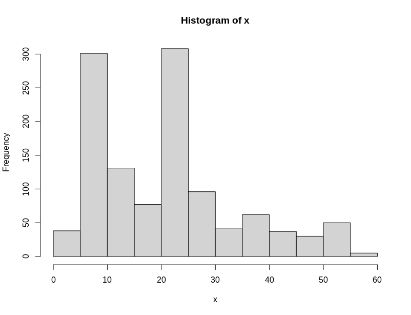
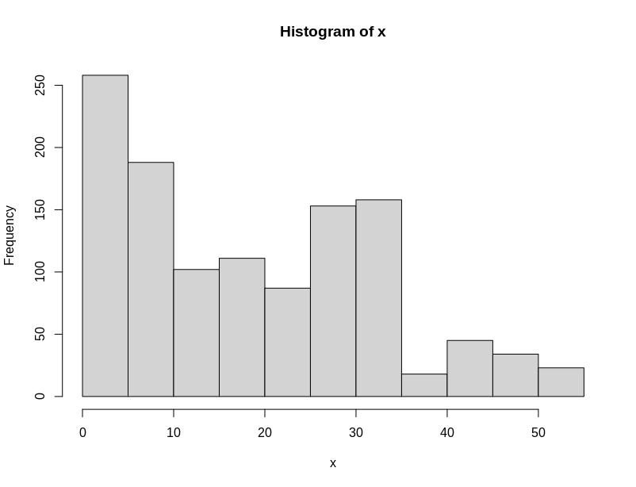

## Pruebas de baps con lineaje 4

- Corri el baps con las siguientes especificaciones con un alineamiento unico del linaaje 4
~~~
hb.results <- hierBAPS(snp.matrix, n.cores = 8, max.depth = 10, n.pops = 100, quiet = TRUE)
~~~

- Arrroja este resultado de calculo y crea el siguiente arbol con los 10 niveles indenticos
~~~
> head(hb.results$partition.df)
  Isolate level 1 level 2 level 3 level 4 level 5 level 6 level 7 level 8 level 9 level 10
1     G01       1       1       1       1       1       1       1       1       1        1
2     G02       1       1       1       1       1       1       1       1       1        1
3     G03       1       1       1       1       1       1       1       1       1        1
4     G04       1       1       1       1       1       1       1       1       1        1
5   G1000       1       1       1       1       1       1       1       1       1        1
6   G1002       1       1       1       1       1       1       1       1       1        1
~~~

### El alineamiento al parecer estaba mal copiado, copia siempre desde el servidor
- **DESCARTADO, ALINEAMIENTO CORRECTO**
- Realizamos una nueva corrida con los siguientes parametros, copiando el alineamiento desde el sevidor.
~~~
hb.results <- hierBAPS(snp.matrix, n.cores = 6, max.depth = 8, n.pops = 100, quiet = TRUE)
~~~
- Mismo reusultado
~~~
> head(hb.results$partition.df)
  Isolate level 1 level 2 level 3 level 4 level 5 level 6 level 7 level 8
1     G01       1       1       1       1       1       1       1       1
2     G02       1       1       1       1       1       1       1       1
3     G03       1       1       1       1       1       1       1       1
4     G04       1       1       1       1       1       1       1       1
5   G1000       1       1       1       1       1       1       1       1
6   G1002       1       1       1       1       1       1       1       1
~~~
- **Hay un detalle en el alineamiento que no no estoy observando**
- **DESCARTADO, ALINEAMIENTO CORRECTO**
- Probemos snp-site:
~~~
snp-sites -o run_1177.fas run_alignment_no_resis.fas
~~~
Lo probamos pero no redujo el tamaño de la matriz. 473.**9** Mb vs 473.**8** Mb

1. Repetimos alineamiento y corremos de nuevo?
- No es el alineamiento.
2. Bajamos los parametros, corrimos en servidor y en PC.
- Resultados del PC
~~~
hb.results <- hierBAPS(snp.matrix, n.cores = 6, max.depth = 8, quiet = TRUE)
> head(hb.results$partition.df)
  Isolate level 1 level 2 level 3 level 4 level 5 level 6 level 7 level 8
1     G01       1       1       1       1       1       1       1       1
2     G02       1       1       2       5       3       2       2       2
3     G03       1       2       6       8       4       3       3       3
4     G04       2       4       9      14       7       5       4       4
5   G1000       1       2       7      20       9       7       5       5
6   G1002       2       5      12      23      13      11       7       6
~~~
Arbol lvl1 to 8:

- Resultados del servidor: Sigue corriendo despues de dos dias??
- Tiene algo que ver el **max.depth = 2**? **No tiene que ver**
- Segunda prueba sigue corriendo despues de 2 dias **Algo pasa en el sv**
~~~
hb.results <- hierBAPS(snp.matrix, n.cores = 16, max.depth = 2, quiet = TRUE)
hb.results <- hierBAPS(snp.matrix, n.cores = 12, max.depth = 8, quiet = TRUE)
~~~

3. Consideramos FastBaps? En proceso.  
Funciono.

### Logramos poner en el mismo arbol Españoles/Bapslvl3/Clusters10snp

Link: https://itol.embl.de/tree/16111121936428041608308653  
-Cerramos aqui el tema y planteo nuevas cosas por hacer.

### Nuevos planteos

1. Jugar con el arbol retirando la raiz.  
No debia interferir y no interfiere.
https://itol.embl.de/tree/16111121936433581608305070

2. Dejar solo una muestra por cluster  
Por cluster o por cluster español?

3. Revisar si el baps esta agrupando los clusters  
Fastbaps y rhierbaps agrupan de manera correcta los clusters.

4. Realizar con FastBaps  
Resultados similares al rhierbaps.

5. Hay algo con mi alineamiento que este mal? Por que se separan los genotipos?
- Los separa por que son genotipos, no deben forzosamente estar juntos en la filogenia.
- El resultado no debe ser exacto al tu representacion de linajes y clusters es un experimento.
- Se detectan genotipos; no linajes, ni clusters.

### Resumen / Actualización

- Trabajamos solo con el linaje 4
- Detectamos genotipos a varios lvls con basp y fastbaps, elegimos el nivel 3 de ambos para buscar asociaciones. El lvl 2 da muy pocos genotipos (15 -16) y el lvl 4 da demasiados (100 o mas).
- Arbol actual: https://itol.embl.de/tree/16111121936428041608308653

### Realizar tablas descriptivas e histogramas de los datos (subcarpeta: Merge de arbol 1177)

##### Distribucion Bapslvl3 (x=genotipos, y=numero de aislados)

~~~
        factorx Freq cumFreq   relative
1  (0.945,5.58]   38      38 0.03228547
2   (5.58,10.2]  301     339 0.25573492
3   (10.2,14.8]  106     445 0.09005947
4   (14.8,19.3]  100     545 0.08496177
5   (19.3,23.9]  195     740 0.16567545
6   (23.9,28.5]  193     933 0.16397621
7   (28.5,33.1]   45     978 0.03823280
8   (33.1,37.7]   56    1034 0.04757859
9   (37.7,42.2]   40    1074 0.03398471
10  (42.2,46.8]   21    1095 0.01784197
11  (46.8,51.4]   47    1142 0.03993203
12  (51.4,56.1]   35    1177 0.02973662
~~~

##### Distribucion FastBapslvl3 (x=genotipos, y=numero de aislados)

~~~
       factorx Freq cumFreq   relative
1  (0.948,5.33]  258     258 0.21920136
2   (5.33,9.67]  135     393 0.11469839
3     (9.67,14]  127     520 0.10790144
4     (14,18.3]  100     620 0.08496177
5   (18.3,22.7]   69     689 0.05862362
6     (22.7,27]  128     817 0.10875106
7     (27,31.3]   99     916 0.08411215
8   (31.3,35.7]  141    1057 0.11979609
9     (35.7,40]   18    1075 0.01529312
10    (40,44.3]   23    1098 0.01954121
11  (44.3,48.7]   49    1147 0.04163127
12  (48.7,53.1]   30    1177 0.02548853
~~~

### Generemos tabla con genotipos/ numero de aislados/ españoles/ en cluster 10 snps

- Realizamos varios merges y obtuvimos varias tablas usando el archivo: "Frecuencias_e_histogramas.R", este archivo tiene anotaciones interesantes para realizar los merges.

En esta tabla (datos:bapslvl3) y en la tabla Filtramos:
 - Genotipos con mas de 20 aislados
 - Porcentaje de españoles > 50 %

Read: Whole Genome Sequencing and Spatial Analysis Identifies Recent Tuberculosis Transmission Hotspots in Ghana

### Planteo de Mariana ¿Cambiar la semilla intefiere en los resultados?

- Cambiamos la semilla en el Rhierbaps, el resultado de la tabla de genotipos es identico.  
El cambio de la semilla no afecta la deteccion de los genotipos.

~~~
set.seed(1234) -> Original
set.seed(2345) -> Cambio de semilla

> head(hb.results$partition.df)
  Isolate level 1 level 2 level 3 level 4 level 5 level 6 level 7 level 8
1     G01       1       1       1       1       1       1       1       1
2     G02       1       1       2       5       3       2       2       2
3     G03       1       2       6       8       4       3       3       3
4     G04       2       4       9      14       7       5       4       4
5   G1000       1       2       7      20       9       7       5       5
6   G1002       2       5      12      23      13      11       7       6
~~~
