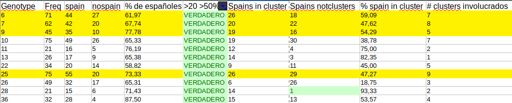

## Planteos finales y resultados

- Revisar genotipos bapslvl3 6-7-9-25

### Juntar valores de lvls de Rhierbaps & Fastbaps en un solo arbol

Hecho : https://itol.embl.de/tree/16111121936428041608308653#

### Realizar tablas de valores de Rhierbaps & Baps

Lvl3 -> Bapslvl3 : Fastbapslvl3  
Lvl2 -> Bapslvl2 : Fastbapslvl2

Ejemplo:

### Correr Baps con solo una muestra por cluster

### Explicame en pocas palabras los Bootstraps del Rhierbaps y del Fastbaps

### Extras

- Read: "Whole Genome Sequencing and Spatial Analysis Identifies Recent Tuberculosis Transmission Hotspots in Ghana"
- Ver: (https://coursesandconferences.wellcomegenomecampus.org/our-events/abphm-2021/?utm_campaign=1868895_Upcoming%20deadlines%20%28Jan%2021%2C%20Feb%2C%20Mar%202021%29&utm_medium=email&utm_source=ACSC&dm_i=2SUU,1421R,UWSD1,4AB5U,1)
