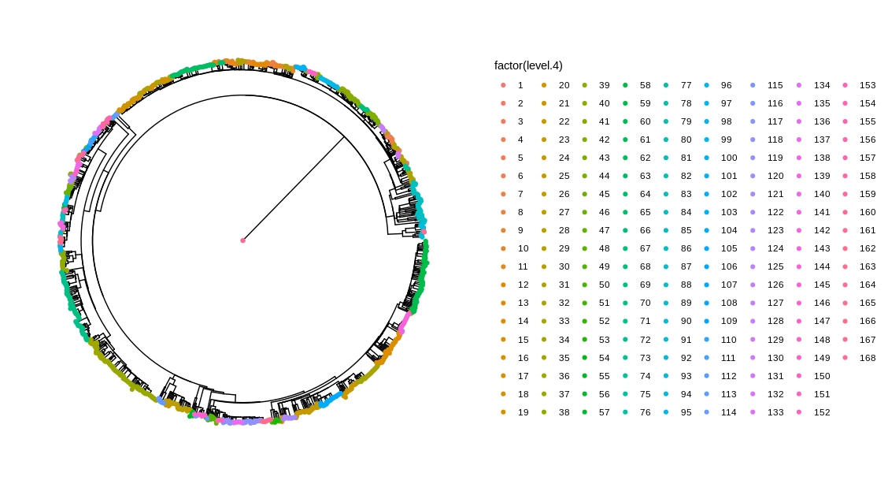

## Pruebas de baps con lineaje 4

- Corri el baps con las siguientes especificaciones con un alineamiento unico del linaaje 4
~~~
hb.results <- hierBAPS(snp.matrix, n.cores = 8, max.depth = 10, n.pops = 100, quiet = TRUE)
~~~

- Arrroja este resultado de calculo y crea el siguiente arbol con los 10 niveles indenticos
~~~
> head(hb.results$partition.df)
  Isolate level 1 level 2 level 3 level 4 level 5 level 6 level 7 level 8 level 9 level 10
1     G01       1       1       1       1       1       1       1       1       1        1
2     G02       1       1       1       1       1       1       1       1       1        1
3     G03       1       1       1       1       1       1       1       1       1        1
4     G04       1       1       1       1       1       1       1       1       1        1
5   G1000       1       1       1       1       1       1       1       1       1        1
6   G1002       1       1       1       1       1       1       1       1       1        1
~~~

### El alineamiento al parecer estaba mal copiado, copia siempre desde el servidor
- **DESCARTADO, ALINEAMIENTO CORRECTO**
- Realizamos una nueva corrida con los siguientes parametros, copiando el alineamiento desde el sevidor.
~~~
hb.results <- hierBAPS(snp.matrix, n.cores = 6, max.depth = 8, n.pops = 100, quiet = TRUE)
~~~
- Mismo reusultado
~~~
> head(hb.results$partition.df)
  Isolate level 1 level 2 level 3 level 4 level 5 level 6 level 7 level 8
1     G01       1       1       1       1       1       1       1       1
2     G02       1       1       1       1       1       1       1       1
3     G03       1       1       1       1       1       1       1       1
4     G04       1       1       1       1       1       1       1       1
5   G1000       1       1       1       1       1       1       1       1
6   G1002       1       1       1       1       1       1       1       1
~~~
- **Hay un detalle en el alineamiento que no no estoy observando**
- **DESCARTADO, ALINEAMIENTO CORRECTO**
- Probemos snp-site:
~~~
snp-sites -o run_1177.fas run_alignment_no_resis.fas
~~~
Lo probamos pero no redujo el tamaño de la matriz. 473.**9** Mb vs 473.**8** Mb

1. Repetimos alineamiento y corremos de nuevo?
- No es el alineamiento.
2. Bajamos los parametros, corrimos en servidor y en PC.
- Resultados del PC
~~~
hb.results <- hierBAPS(snp.matrix, n.cores = 6, max.depth = 8, quiet = TRUE)
> head(hb.results$partition.df)
  Isolate level 1 level 2 level 3 level 4 level 5 level 6 level 7 level 8
1     G01       1       1       1       1       1       1       1       1
2     G02       1       1       2       5       3       2       2       2
3     G03       1       2       6       8       4       3       3       3
4     G04       2       4       9      14       7       5       4       4
5   G1000       1       2       7      20       9       7       5       5
6   G1002       2       5      12      23      13      11       7       6
~~~
Arbol:

- Resultados del servidor: Sigue corriendo despues de dos dias??
- Tiene algo que ver el **max.depth = 2**?
~~~
hb.results <- hierBAPS(snp.matrix, n.cores = 16, max.depth = 2, quiet = TRUE)
~~~

3. Consideramos FastBaps? En proceso.

- *Descartar la posibilidad de que el root en el iqtree te genere problemas.*
